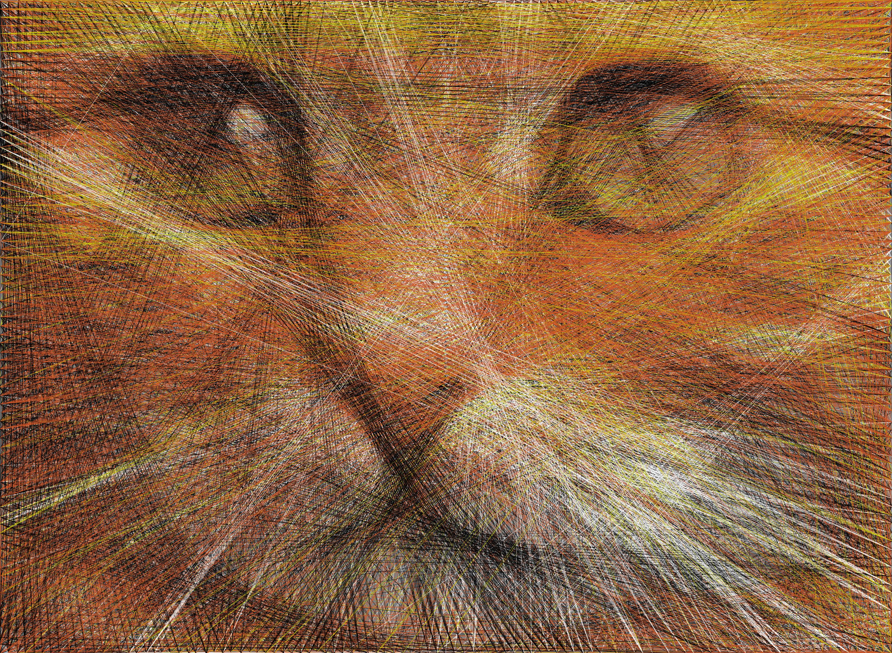
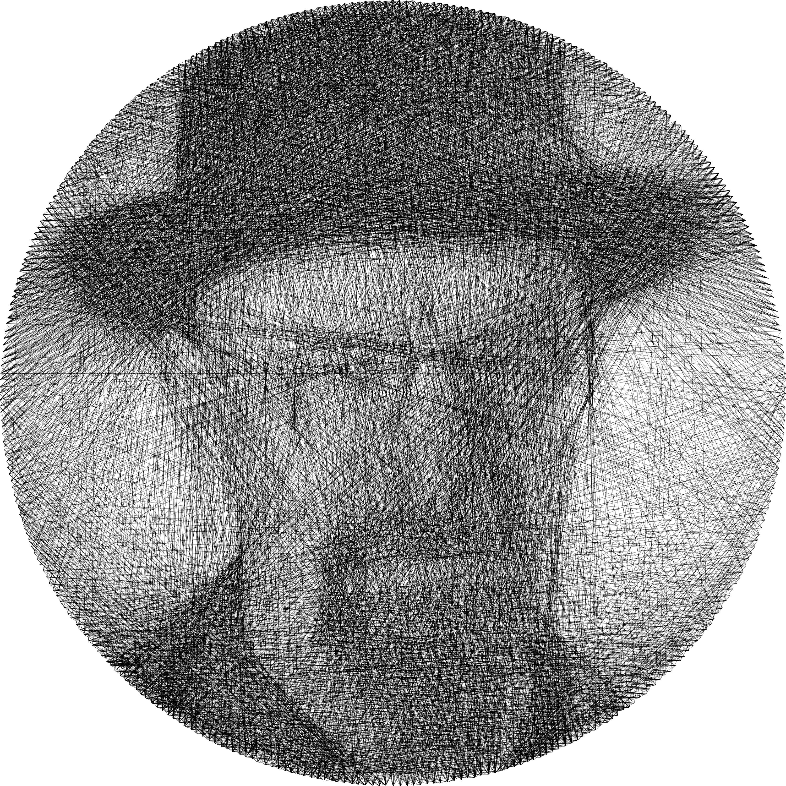

[](https://colab.research.google.com/github/roy-hachnochi/string-art/blob/main/algorithmic_string_art_playground.ipynb)
[](https://roy-hachnochi.github.io/string-art/)

# Algorithmic String Art

A personal weekend project aimed at using computational optimization to recreate images by connecting strings through nails.  
Based on the inspiringly creative work by Petros Vrellis: [A New Way to Knit (2016)](https://artof01.com/vrellis/works/knit.html).  

[Colab](https://github.com/roy-hachnochi/string-art/blob/main/algorithmic_string_art_playground.ipynb) notebook playground to generate string-art images and instructions from your own images.  
[Project Page](https://roy-hachnochi.github.io/string-art/) with detailed explanations and mathematical derivations of the algorithm and pipeline.


## Setup
1. Clone the repo:
    ```
    git clone https://github.com/roy-hachnochi/string-art
    cd string-art/
    ```
2. Create a new environment:  
    **Conda:** (Recommended)
    ```
    conda env create -f environment.yml
    conda activate string-art
    ```
    **Pyenv:** (Not tested)
    ```
    pyenv virtualenv 3.12 string-art
    pyenv activate string-art
    pip install -r requirements.txt
    ```

## Usage
```
python main.py [args]
```

### Examples
- Preconfigured BW canvas
    ```
    python main.py --config bw_config --image examples/don_draper.jpg --result results/don_draper --name don_draper_BL_example --optimizer_type binary_linear --debug results/don_draper/BL_example --verbose
    ```

- Preconfigured multicolor canvas
    ```
    python main.py --config multicolor_config --image examples/fish.jpg --result results/fish --name fish_MCBL_example --colors #ffffff #ff6400 #3296dc #000000 --optimizer_type multicolor_binary_linear --debug results/fish/MCBL_example --verbose
    ```

- Manual configuration (not recommended)  
    Must set all following arguments in this case: `canvas_size, nails, shape, fiber_width, n_fibers, optimizer_type`
    ```
    main.py --image examples/fish.jpg --result results/fish2 --name fish_MCBL_example --multicolor --canvas_size 600 600 --nails 360 --shape rectangle --fiber_width 0.12 --n_fibers 10000 --optimizer_type multicolor_binary_linear --colors #ffffff #ff6400 #3296dc #000000 --optimizer_type multicolor_binary_linear --debug results/fish2/MCBL_example --verbose
    ```

### Arguments
Open each cell to see related arguments.

<details>
<summary><strong>General arguments</strong></summary>

- `--image` - Path to input image.
- `--result` - Result folder path.
- `--weights` - Path to optimization weights image (optional). Black (0) - high weight, White (1) - low weight.
- `--config` - Name of predefined config in string_art/configs (optional).
- `--debug` - Debug folder path (optional).
- `--name` - Name of experiment/image (optional).
- `--verbose` - Verbose prints during optimization.
- `--preprocess_only` - Only perform preprocessing (to observe target image before optimization).
- `--postprocess_only` - Only perform postprocessing (to choose color paths combination method or number of strings after optimization).
- `--save_mp4` - Save MP4 of string-art rendering process.
- `--plot_result` - Show result when finished.

</details>

<details>
<summary><strong>Canvas arguments</strong></summary>

#### Basic params
- `--canvas_size` - Canvas size (h, w) in mm. (Recommended: around (600, 600))
- `--nails` - Number of nails around canvas. (Recommended: 360)
- `--shape` - Shape of the canvas (ellipse/rectangle).
- `--fiber_width` - Real fiber width in mm. (Recommended: 0.12, but meant to represent the actual thread width)

#### Advanced params
- `--fiber_constant` - Use constant fiber simulation instead of antialiasing fiber. (Not reommended)
- `--bg_color` - Background color (HEX). (Recommended: #ffffff)

</details>

<details>
<summary><strong>Preprocessing arguments</strong></summary>

- `--optimization_resolution` - Optional optimization canvas resolution (h, w). Use when image is too big, to resize to around (900, 900).
- `--colors` - Manual palette, list of HEX colors of fibers to use.
- `--rgbcmykw` - Use RGBCMYKW subset as palette.
- `--n_colors` - Number of colors to use for dithering palette.
If neither `--colors` nor `--rgbcmykw` are given, the algorithm will use clustering methods to estimate a palette of fiber colors, which is not recommended as it often results in poor recreation.

</details>

<details>
<summary><strong>Optimizer arguments</strong></summary>

#### Basic params
- `--n_fibers` - Max number of fibers in the canvas. Also works as postprocessing flag to more quickly test the effect of reducing number of fibers.  (Recommended: ~3,000 for B&W, ~10,000 for multicolor)
- `--optimizer_type` - Type of optimizer to use (greedy/LS/binary_linear/multicolor_binary_linear - Recommended: binary_linear).
- `--multicolor` - Apply multicolor optimization instead of B&W.

#### Advanced params
- `--error_threshold` - Sufficient error threshold to halt during optimization.
- `--noncontinuous` - Without this flag, each line will be forced to start from the second nail of the previous line, to form a continuous path. This flag disables enforcing a continuous path.(Not recommended)
- `--n_random_nails` - Limit connections to random subset of nails each iteration. Used mainly for speedup. (Recommended: 150)
- `--threshold` - Threshold for setting fiber values in least squares optimizer.
- `--simulate_combine` - The default method for interweaving colors is by a fixed interval (e.g., 25% of color #1, 25% of color #2, 25% of color #3, and again 25% of color #1, and so on). This flag tries another combination method, by choosing the best color to add each step based on error simulation (assuming that lines which decrease the error the most should be on top). Valid only when not using multicolor_binary_linear optimizer.
- `--interval` - Interweaving interval to switch between colors when combining (0 < interval <= 1), only for `simulate_combine = False`. (Recommended: 0.1-0.4, only when not using multicolor_binary_linear optimizer)

</details>

## Examples
<details>
<summary>📷 Click to view more results</summary>

<p align="center">
  
  
  
  
  
  
  
  
  
  
  
  
  
  
  
  
  
  
  
  
  
  
  
  
  
  
  
  
  
  
  
  
  
  
  
  
  
</p>

</details>

## References
- **[A New Way to Knit (2016)](https://artof01.com/vrellis/works/knit.html), Petros Vrellis** - The original String-Art project, which came up with this wonderful and creative idea, and inspired the work for everyone playing around with this problem.
- **[The Mathematics of StringArt](https://www.youtube.com/watch?v=WGccIFf6MF8&t=17s), Virtually Passed** - A fun and well-described youtube video, which was the first interaction I got with this line of work and inspired me to try it myself.
- **[Computational String Art](https://www.perfectlynormal.co.uk/blog-computational-thread-art), Callum Mcdougal** - An excellent blogpost I found while working on the project, which gave me some very clever and innovative ideas for the multicolor part, as well as most of the example images used in this page.
- **String Art: Towards Computational Fabrication of String Images, Birsak et. al.** - The best (and almost only) academic article I found related to the String-Art problem.